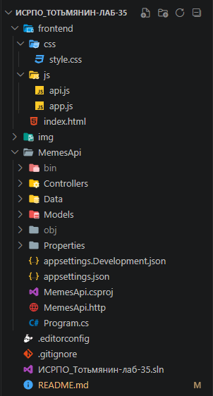

# Лабораторная работа №29. REST API: контроллеры и маршруты

P.S: НИ В КОЕМ СЛУЧАЕ ЭТА РАБОТА И ВСЕ ПОСЛЕДУЮЩИЕ И ПРЕДЫДУЩИЕ НЕ НАПИСАНЫ С ПОМОЩЬЮ GPT И ТОМУ ПОДОБНОЕ!!! (ну практически, кроме README.md)

## Основная информация

- **ФИО:** Тотьмянин Тихон Алексеевич

- **Группа:** ИСП-232

- **Дата:** 05.05.2026  

## Описание работы

В ходе лабораторной работы изучены принципы архитектуры REST, создан контроллер ASP.NET Core с полным набором CRUD-операций, освоено тестирование API через Swagger UI и REST Client в VS Code.

## Структура проекта



## Запуск

```bash
cd TaskApi
dotnet restore
dotnet run
```

## Итоговая таблица


## Итоговая таблица: что изучили в лабораторной


## Вывод

### Главные выводы

- REST — архитектурный стиль, а не протокол: ресурсы определяются URL, операции — HTTP-методами.
- Контроллеры в ASP.NET Core обеспечивают чистую структуру и автоматическую документацию через Swagger.
- DTO защищают API: клиент передаёт только разрешённые поля, сервер генерирует служебные данные (Id, CreatedAt).
- Правильные статусы ответа — часть контракта API: клиент понимает результат по коду, а не по парсингу тела ответа.