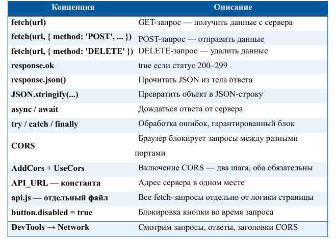

# Лабораторная работа №35. Подключаем фронтенд к API: доска мемов

P.S: НИ В КОЕМ СЛУЧАЕ ЭТА РАБОТА И ВСЕ ПОСЛЕДУЮЩИЕ И ПРЕДЫДУЩИЕ НЕ НАПИСАНЫ С ПОМОЩЬЮ GPT И ТОМУ ПОДОБНОЕ!!! (ну практически, кроме README.md)

## Основная информация

- **ФИО:** Тотьмянин Тихон Алексеевич

- **Группа:** ИСП-232

- **Дата:** 05.05.2026  

## Описание работы

В ходе лабораторной работы изучено, как браузерный JavaScript общается с сервером через `fetch`, рассмотрена проблема CORS и способы её решения, создан полноценный frontend с нуля (HTML+CSS+JS в отдельных файлах), реализован полный цикл работы с данными: загрузка списка, добавление и удаление мемов через fetch-запросы.

## Структура проекта


## Запуск

```bash
cd TaskApi
dotnet restore
dotnet run
```

## 🌐 Реализованные маршруты API

| Метод | Маршрут | Описание | Статус |
|-------|---------|----------|--------|
| `GET` | `/api/memes` | Получить все мемы | 200 |
| `GET` | `/api/memes/{id}` | Получить мем по ID | 200 / 404 |
| `POST` | `/api/memes` | Добавить новый мем | 201 |
| `DELETE` | `/api/memes/{id}` | Удалить мем | 204 |

## 🎨 Frontend-функционал

### Реализованные возможности

1. **Загрузка мемов** — автоматическая загрузка при открытии страницы
2. **Добавление мема** — форма с полями: название, категория, рейтинг (1-5 звёзд)
3. **Удаление мема** — кнопка удаления с подтверждением
4. **Валидация** — проверка обязательных полей на клиенте и сервере
5. **Обработка ошибок** — отображение ошибок при недоступности сервера
6. **Адаптивный дизайн** — CSS Grid для карточек мемов

## Итоговая таблица: что изучили в лабораторной


